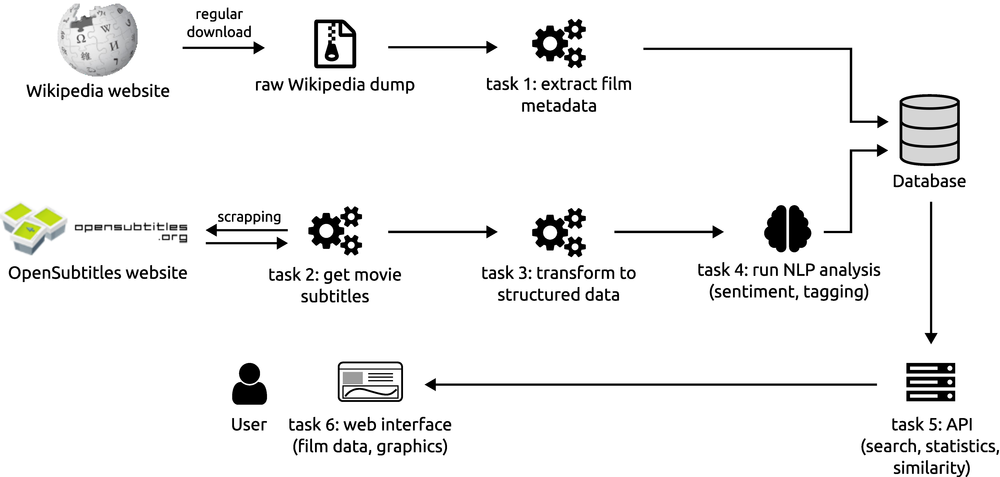
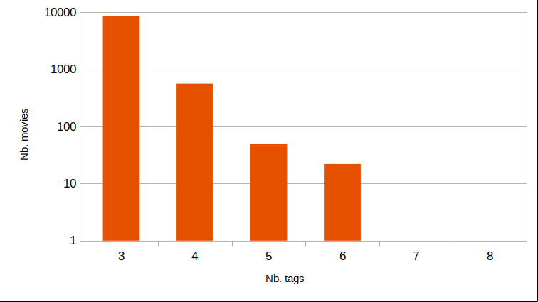
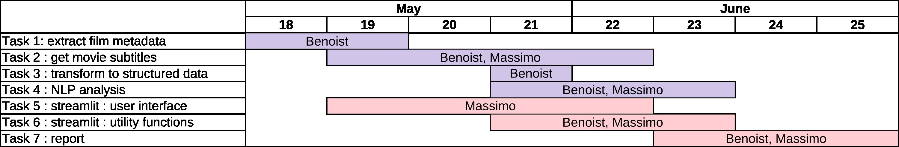

# MA-WEM: Projet - Analyse de sentiments des films basés sur les dialogues

- Massimo De Santis
- Benoist Wolleb

# Contexte et objectifs du projet

## Contexte

En raison du nombre croissant de films disponibles et de la quantité d'informations disponibles sur chaque film, il est devenu nécessaire de mettre en place des techniques efficaces pour analyser et catégoriser ces films. Dans ce contexte, les méthodes d'apprentissage automatique et de traitement du langage naturel (NLP) offrent des possibilités intéressantes pour répondre à cette demande.

Dans le cas de notre projet, nous nous intéressons à l'analyse des films à partir de leurs dialogues, en utilisant des techniques de NLP et de web scraping pour récupérer les métadonnées des films et leurs sous-titres.

## Objectifs

L'objectif principal de ce projet est d'analyser les sentiments présents tout au long des films en utilisant des techniques de NLP et de classer les films thématiquement à l'aide de cette analyse. Plus précisément, nous visons à :

1. Récupérer les métadonnées des films à partir d'un dump de Wikipédia, incluant des informations telles que le titre, l'année de sortie, le réalisateur, les acteurs, le genre et la durée.

2. Scraper les sous-titres des films sur le site https://www.opensubtitles.org, en veillant à sélectionner les sous-titres anglais correspondant aux films analysés.

3. Effectuer une analyse de sentiment sur les dialogues extraits des sous-titres pour détecter les émotions présentes tout au long des films.

4. Classer les films selon des thèmes basés sur l'analyse de sentiment effectuée, en tirant parti de techniques de clustering ou de classification supervisée.

5. Présenter les résultats de l'analyse de manière graphique et intuitive sur une interface utilisateur web, incluant des informations sur les films, les sentiments et les statistiques de langage.

6. Fournir un moyen pour les utilisateurs de rechercher des films similaires en fonction de leur signature émotionnelle et de leurs thèmes, aidant ainsi à la découverte de nouveaux films en fonction des préférences personnelles.

En résumé, ce projet vise à explorer le potentiel des techniques de NLP et de web scraping pour analyser les films à partir de leurs dialogues et les métadonnées récupérées. Les objectifs comprennent la détection des sentiments, la classification thématique et la présentation des résultats sur une interface utilisateur web, permettant une meilleure compréhension et une exploration plus facile des films en fonction de leurs émotions et thèmes.

# Données

Pour mener à bien notre étude sur l'analyse de sentiments et la classification thématique des films, nous avons utilisé diverses sources de données.

## Dump de Wikipédia

Nous avons collecté un large échantillon de métadonnées de films à partir d'un dump de Wikipédia. Ce dump contient des informations telles que le titre, l'année de sortie, le réalisateur, les acteurs, le genre et la durée de chaque film. Il constitue notre base de données principale pour les films à analyser. Après un traitement initial, notre sélection finale comporte 9 170 films disponibles pour l'analyse.

## Sous-titres issus d'OpenSubtitles

Les sous-titres des films ont été récupérés sur le site https://www.opensubtitles.org/fr. Cette source nous a permis d'accéder à une grande quantité de sous-titres en anglais, en lien avec les films listés dans notre échantillon issu du dump de Wikipédia. Nous avons utilisé des techniques de web scraping pour récupérer les fichiers de sous-titres et les organiser par film. Les sous-titres sont ensuite convertis en fichiers JSON pour faciliter leur utilisation dans nos analyses.

## Tags prédéfinis

Afin d'identifier les thèmes des films à partir de leurs dialogues, une liste de 100 tags a été définie manuellement. Cette liste comprend des catégories génériques telles que "action", "aventure" ou "thriller", ainsi que des catégories plus spécifiques comme "coming of age", "Journey" ou "dark comedy". Cette liste permet ainsi d'explorer une variété de thèmes potentiels dans les films.

## Preprocessing des données

Avant de procéder à l'analyse du contenu des films, nous effectuons un preprocessing pour nettoyer les données et les préparer à être traitées par les modèles de NLP.

### Nettoyage des métadonnées

Les données de métadonnées extraites du dump de Wikipédia requièrent un nettoyage avant d'être utilisées. Les erreurs et incohérences sont supprimées, les données manquantes sont interpolées si possible et tout est normé dans un format standard.

### Préparation des sous-titres

Les fichiers de sous-titres sont tout d'abord convertis en fichiers JSON pour faciliter leur traitement. Ensuite, nous groupons les dialogues en fonction des fenêtres temporelles, permettant ainsi d'analyser plusieurs lignes de dialogue en même temps lors de l'évaluation des sentiments. Cela améliore la précision de l'analyse et permet de prendre en compte le contexte des dialogues.

## Données finales

Une fois les données prétraitées, nous disposons d'un échantillon de 9 170 films avec leurs métadonnées, sous-titres et tags associés pour effectuer nos analyses. Ces données sont prêtes à être traitées par les modèles de traitement du langage naturel et de classification pour répondre aux objectifs définis dans ce projet, à savoir l'analyse de sentiments, la classification thématique et la présentation des résultats sur une interface utilisateur web.

Dans l'ensemble, notre sélection de données comprend une variété de genres, d'années et de réalisateurs, permettant ainsi une analyse diversifiée et représentative des films. Il convient de noter que certaines limitations subsistent, telles que la présence de films avec peu de dialogues ou des erreurs dans les fichiers collectés. Malgré ces défis, notre base de données constitue une ressource suffisante pour explorer le potentiel des techniques de NLP et de web scraping dans l'analyse des films à partir de leurs dialogues et métadonnées.

# État de l'art

L'analyse de données dans le domaine du cinéma amène à travailler sur plusieurs aspects du langage naturel. Dans ce chapitre, nous allons discuter des modèles état de l'art utilisés dans le traitement du langage naturel (NLP) qui ont été employés dans notre projet.

## Modèles NLP utilisés

### Modèles basés sur les Transformers

Les modèles basés sur les Transformers ont émergé ces dernières années comme une référence en matière de traitement du langage naturel. En particulier, les modèles tels que BERT, GPT-2 et RoBERTa sont connus pour leur performance exceptionnelle dans diverses tâches de NLP.

Dans notre projet, nous avons utilisé les modèles suivants basés sur des Transformers :

1. **Twitter-roBERTa-base for Sentiment Analysis (cardiffnlp/twitter-roberta-base-sentiment-latest)**: Ce modèle est basé sur RoBERTa, une variante de BERT optimisée pour la performance. Il a été spécifiquement pré-entraîné pour l'analyse de sentiments sur des extraits de Twitter. Ce modèle est utilisé dans notre projet pour analyser les sentiments des dialogues de films. Il fournit des scores de probabilité pour trois classes de sentiments: positif, négatif et neutre.

2. **BART-large-mnli (facebook/bart-large-mnli)**: BART est un autre modèle basé sur les Transformers et est adapté pour la génération de texte ainsi que pour les tâches de classification de texte. Ce modèle a été pré-entraîné pour la tâche de "Zero Shot Text Classification" et est utilisé dans notre projet pour extraire les thèmes des films à partir des dialogues. En fournissant un texte et une liste de tags potentiels au modèle, il est capable de prédire les probabilités associées à chaque tag.

Ces modèles basés sur les Transformers ont montré des résultats prometteurs dans diverses applications de NLP, notamment la traduction automatique, la génération de texte, la reconnaissance d'entités nommées et la classification de texte. En particulier, les modèles tels que BERT, GPT-2 et RoBERTa ont démontré une capacité à capturer des informations contextuelles et à apprendre de manière non supervisée à partir de vastes quantités de données textuelles.

En utilisant ces modèles état de l'art dans notre projet, nous espérons améliorer notre compréhension des émotions et des thèmes présents dans les films grâce à l'analyse de leurs dialogues. Grâce à la combinaison d'une analyse de sentiment basée sur RoBERTa et d'une extraction de thèmes basée sur BART, nous visons à fournir une caractérisation détaillée et nuancée des films, permettant ainsi leur classification thématique et émotionnelle.

# Architecture
Dans cette section, nous aborderons l'architecture générale de notre projet de web mining. Nous avons conçu une architecture basée sur un ensemble de différents scripts Python et modèles (NLP) qui permettent de récupérer, prétraiter et analyser les données. De plus, une interface utilisateur web a été développée pour présenter les résultats et faciliter leur exploration.

Dans la suite, nous décrirons en détail les différents composants et étapes de notre pipeline et leur relation entre eux. Nous présenterons également quelques résultats et observations obtenus grâce à notre architecture.

En résumé, notre architecture prend en compte les aspects suivants:

- Récupération des données à partir de sources en ligne telles que Wikipédia et OpenSubtitles
- Prétraitement et nettoyage des données, y compris la conversion des sous-titres au format JSON
- Analyse des données en utilisant des techniques de NLP pour l'analyse de sentiments, la classification thématique et l'extraction de caractéristiques linguistiques
- Présentation des résultats à travers une interface utilisateur web interactive

Dans la suite de ce chapitre, nous décrirons en détail chaque composant et étape de notre pipeline d'architecture. Cela inclut la description des modules et techniques utilisés dans la récupération et l'analyse des données, ainsi que les résultats obtenus et les implications pour notre projet.

## Pipeline
Afin de récupérer et exploiter les données, la pipeline des opérations est grossièrement distincte en deux étapes:

- Récupération des données: parsing du dump Wikipédia, récupération des images de couvertures depuis Wikimédia et récupération des sous-titres depuis OpenSubtitles.
- Transformation des données et analyse: transformation des sous-titres depuis leur format de base SRT en une structure plus facilement utilisable (structurée et indépendante de l'encodage des caractères) et exploitation du texte obtenu pour analyse de sentiments, extraction des thèmes et statistiques NLP.

Tous les scripts qui effectuent ces étapes sont présents dans l'ordre de leur utilisation dans le dossier [analysis](analysis). Le point de départ est le fichier de dump complet de Wikipédia anglophone en format XML qui peut être librement téléchargé depuis [Wikimedia Downloads](https://dumps.wikimedia.org/backup-index.html). Le fichier approprié se trouve dans la section `enwiki` et est normalement nommé `enwiki-YYYYMMDD-pages-articles-multistream.xml.bz2` et pèse environ 20 Gio compressé, et environ 88 Gio décompressé.

### Récupération des données

- `01_parser.py`: parcours le dump Wikipédia (décompressé) à la recherche de toutes les entrées qui correspondent à un film. Pour chacun, les métadonnées sont extraites: titre, année de sortie, distribution, résumé et nom de l'image de couverture. Un identifiant unique (UUID) est généré pour chaque film et servira de clé pour l'identifier dans tout le reste du projet. Ce script prend en paramètre le chemin du dump ainsi que le chemin vers le fichier json résultant contenant toutes les entrées qui sera créé à la fin de l'exécution, par exemple `allmovies.json`. Ce dernier est une simple liste d'objets (`dict`) contenant les données pour chaque film.

- `02_getImages.py`: tente de télécharger les images de couverture pour chaque film. En effet, dans les sources d'un article Wikipédia, l'image de couverture ne consiste pas en un URL vers le fichier, mais uniquement le nom de la ressource Wikimédia. Il faut donc reconstruire le lien vers la véritable image à partir du nom (avec une logique un peu particulière utilisant le hash md5 du nom). Chaque image téléchargée est simplement nommée de la même manière que l'UUID du film correspondant, sans extension. Le script prend en paramètres la collection de films extraite au script précédent `allmovies.json` et un chemin vers un dossier dans lequel stocker toutes les images qui devrait être nommé `images` (car directement utilisé par l'interface avec ce nom). Ce script supporte plusieurs exécution, en reprenant dans l'ordre de la liste des films ne possédant pas d'image (il ne va pas re-télécharger les images déjà existantes).

- `03_removeVideos.py`: nettoie le dossier des images téléchargées avec le script précédent. En effet, pour certains vieux films, l'image de couverture consiste en fait en une vidéo du film lui-même (entier!) et prend donc une grande place inutilement. Ce script prend en paramètre le chemin vers les images téléchargées avec le script précédent, en principe `images`.

- `04_getSubtitles.py`: pour chaque film, tente de télécharger le fichier de sous-titres anglophones depuis OpenSubtitles, en utilisant le fichier de sous-titres ayant le plus grand nombre de téléchargements, donc potentiellement les plus corrects. Les fichiers téléchargés seront nommés en utilisant l'UUID du film correspondant, avec l'extension ".srt". Ce script prend en paramètre la collection de films (`allmovies.json`) ainsi que le chemin vers un dossier dans lequel stocker tous les fichiers de sous-titres, par exemple `subs_srt`. Un paramètre optionnel permet d'introduire un nombre de secondes de délai entre le scrapping de deux films, ce qui aide en cas de blocage. le site OpenSubtitles est en effet susceptible de rapidement bloquer les requêtes, jugées trop nombreuses, avec une page à captcha. Le script supporte donc lui-aussi plusieurs exécution, en reprenant dans l'ordre de la liste des films ne possédant pas de sous-titres (il ne va pas les re-télécharger si un fichier srt est déjà présent dans le dossier de destination).

- `05_srtToJson.py`: convertit tous les fichiers de sous-titres depuis leur format "SRT" en json. En effet, un fichier SRT n'est pas facilement exploitable tel quel, car l'encodage des caractères peut varier, les balises ont une structure particulière, et certaines entrées peuvent même contenir des erreurs. Ce script permet donc de les transformer en une structure plus rigide et avec un encodage fixe en UTF-8. Le script génère un fichier json par film, qui contient une simple liste d'entrée, chacune correspondant à un sous-titre avec les champs (début [seconde], fin [seconde], texte). Le script prend simplement en paramètre le chemin vers le dossier contenant les srt téléchargés au script précédent (`subs_srt`) ainsi que le chemin vers un dossier dans lequel enregistrer les fichiers convertis, par exemple `subs_json`.

- `06_filterMovies.py`: ce script permet de nettoyer un peu la collection de films complète en ne conservant que les films d'un intervalle d'années de sortie donné, et dont on a pu télécharger l'image de couverture et les sous-titres avec les scripts précédents. Dans notre cas, nous sommes passés de presque 39'000 films à seulement 9000 en conservant l'intervalle 1990 à 2022. Ce script génère une nouvelle collection de films qui sera directement utilisable comme source de métadonnées par notre interface. Le script prend en paramètre la collection complète (`allmovies.json`), le chemin vers le dossier des images, le chemin vers les fichiers de sous-titres en json (`subs_json`), l'intervalle d'années à conserver (inclusif) et le chemin vers le nouveau fichier à créer qui devrait être nommé `movies.json` pour que l'interface puisse l'utiliser directement.

### Exploitation des données

- `07_sentimentAnalysis.py`: effectue l'analyse de sentiments à partir des fichiers de sous-titres pour chaque film. Cette opération utilise un modèle d'intelligence artificielle de type BART, basée sur les Transformers, ce qui est très gourmand en ressources. En utilisant une version basée sur CPU, notre analyse a duré plusieurs jours. Cependant, le script détecte automatiquement si un périphérique CUDA est disponible pour accélérer le processus. Les sous-titres de chaque film sont groupés dans une certaine fenêtre temporelle et analysés par le modèle. Le script crée un fichier json pour chaque film analysé, contenant une liste d'entrées (début [seconde], score négatif, score positif). Le script prend en paramètre la collection de films (`movies.json`), le dossier contenant les sous-titres en json (`subs_json`), la taille de la fenêtre temporelle (15 secondes semble une bonne valeur) ainsi que le chemin vers un dossier dans lequel enregistrer les résultats de l'analyse, nommé en principe `analysis` pour être utilisé par l'interface.

- `08_dramaticSignature.py`: calcule les coefficients polynomiaux à n degrés pour correspondre au mieux aux courbes de sentiments positifs, négatifs ainsi qu'à une courbe additionnelle correspond à leur différence. Afin de travailler sur un signal moins bruité, le script utilise une moyenne mouvante pour lisser les courbes. Ce script prend en paramètre la collection de films (`movies.json`), le dossier contenant les résultats de l'analyse de sentiments calculée au script précédent (`analysis`), la taille de la fenêtre pour la moyenne mouvante (128 semble être une bonne valeur), le nombre de degrés à utiliser (16 semble une bonne valeur) et le chemin vers le fichier de résultat dans lequel stocker les données, devrait être nommé `nlp.json`. En effet, ce fichier unique est aussi utilisé comme fichier de sortie commun pour les scripts suivants et est utilisé par l'interface.

- `09_extractTags.py`: extrait les thèmes du film à partir d'une liste de tags fixe. Ce script travaille en concaténant le texte entier des dialogues de chaque film et en le passant à un modèle de type "Zero Shot Classification". Le résultat est une liste de scores par tag, enregistré dans un fichier nommé json nommé avec l'UUID du film correspondant. Ce script prend en paramètre la collection de films (`movies.json`), le dossier contenant les sous-titres en json (`subs_json`) ainsi que le dossier dans lequel créer les json résultats, par exemple `tags`. Comme ce script utilise lui-aussi un modèle de type BART, très gourmand en ressources, l'argument `-c` permet de spécifier le périphérique CUDA à utiliser s'il y en a à disposition.

- `10_getTags.py`: extrait les tags les plus pertinents pour chaque film à partir des scores calculés par le script précédent. Ce script va simplement conserver un nombre minimal de tags, ayant les scores les plus élevés, ainsi que les éventuels tags suivants s'ils dépassent un certain seuil. Ce script prend en paramètre la collection de films (`movies.json`), le dossier contenant les sous-titres en json (`subs_json`) ainsi que le chemin vers le fichier de résultat commun dans lequel stocker les données, devrait être nommé `nlp.json`. Des paramètres optionnels permettent de définir le nombre minimal de tags à conserver (3 dans notre cas), ainsi que le seuil pour les tags optionnels (0.5 dans notre cas).

- `11_nlpStats.py`: calcule les statistiques linguistiques (TTR, score Flesch–Kincaid, score de lisibilité) pour chaque film. Ce script prend en paramètre la collection de films (`movies.json`), le dossier contenant les sous-titres en json (`subs_json`) ainsi que le chemin vers le fichier de résultat commun dans lequel stocker les données, devrait être nommé `nlp.json`.

### Interface
L'interface est une page web unique (SPA) créée en utilisant le package `streamlit` et qui utilise les différents fichiers de sortie des scripts de la partie extraction et analyse. Le dossier contenant ces données devrait contenir les éléments suivants:

- `movies.json`: la collection des films et leurs métadonnées, en principe l'output du script `06_filterMovies.py` (chargé en mémoire en entier).
- `nlp.json`: les données issues de la partie analyse linguistique, contenant les signatures de l'évolution dramatique, les tags et les statistiques pour chaque film, en principe les sorties combinées des scripts `08_dramaticSignature.py`, `10_getTags.py` et `11_nlpStats.py` (chargé en mémoire en entier).
- `images`: dossier contenant les images de couverture pour chaque film, à afficher dans le panneau de détails du film sélectionné (chargé à la volée).
- `analysis`: dossier contenant l'évolution détaillée des sentiments au cours du film, utilisée pour dessiner les graphiques, en principe la  sortie du script `07_sentimentAnalysis.py` (chargé à la volée).

# Analyse des données
Afin d’explorer les données que nous avons obtenues via le dump Wikipédia ainsi que l’extraction depuis OpenSubtitles, nous travaillons dans des notebooks jupyter, ce qui nous permet une grande flexibilité. Une fois que les différents traitements à apporter aux données ainsi qu’aux résultats, obtenus via les algorithmes ou modèles d’intelligence artificielle, sont connus, le code est nettoyé et placé dans différents scripts python qui peuvent alors être utilisés directement.

Notre cas d’étude est le film “Interstellar” réalisé par Christopher Nolan et sorti en 2014. Nous l’avons sélectionné tout simplement car nous l’avions tous deux vu, car il possède une évolution scénaristique typique (en 3 actes) et est centré sur des thématiques probablement simples à détecter de manière automatique : science-fiction, famille, amour, trahison.

Les caractéristiques que nous souhaitons extraire de manière automatique sont les suivantes :
- Analyse de sentiments depuis les lignes de dialogue, ce qui ramené à l’échelle du film entier permettrait de déterminer l’évolution dramatique générale tout au long du déroulement du film.
- Extraction des thèmes et mots clés, ce qui permettrait d’isoler les sujets principaux et de classer les films par thème, de manière automatique.
- Calcul de diverses statistiques de langage, comme la richesse du vocabulaire ou l’indice de lisibilité.

## Analyse de sentiments
L’analyse de sentiments des films est au cœur de notre projet. Tout l’enjeu sera de déterminer si les changements d’émotions détectés via les dialogues sont cohérents par rapport à la véritable évolution dramatique du film. En effet, bien que le texte lui-même soit porteur de sens, l’émotion est aussi en très grande partie véhiculée par les acteurs, dans la manière de dire les répliques, ainsi que leur jeu de manière générale, et ce qu’il se passe à l’image bien évidemment.

Notre première intuition a été de grouper les sous-titres, afin d’effectuer l’analyse sur plus d’une seule ligne de dialogue. Le langage “parlé”, contrairement à de la prose littéraire, est relativement peu riche syntaxiquement et il est probable qu’analyser les sentiments d’une seule phrase donne des résultats très pauvres.

Nous avons donc groupé les sous-titres dans une fenêtre temporelle de 15 secondes, obtenant ainsi 4 mesures par minutes, soit 240 par heure, au plus car il y a probablement plusieurs intervalles où, selon l’action à l’écran, aucun dialogue n’est présent. La séparation en petits blocs de quelques secondes permet probablement aussi d’obtenir une mesure cohérente par rapport à la scénographie du film. En effet, la tonalité dramatique est en principe cohérente au sein d’une même scène, mais peut changer radicalement lors d’un changement de scène. Effectuer une mesure sur des intervalles séparés dans le temps permet probablement d’isoler les dialogues par scène.

Ensuite, le texte est passé pour analyse de sentiments au modèle “Twitter-roBERTa-base for Sentiment Analysis” [twitter-roberta-base-sentiment-latest](https://huggingface.co/cardiffnlp/twitter-roberta-base-sentiment-latest) qui est un modèle de type BERT (transformer) entraîné pour la classification en 3 classes “négatif”, “positif” et “neutre” sur des extraits de Twitter. Ce modèle fournit en sortie un score de probabilité entre 0 et 1 pour les 3 classes.

L’analyse “brute” des sentiments depuis les dialogues est très bruitée, ce qui était attendu car, comme dit plus haut, il est difficile de calculer la tonalité depuis le langage parlé. Sur ces données, nous avons appliqué un lissage par moyennes mouvantes en essayant plusieurs largeurs de fenêtre et avons obtenu des résultats très intéressants, et visuellement interprétables :

Premièrement, on constate de manière assez logique que les courbes sont inversement corrélées. Deuxièmement, les différents pics semblent marquer la présence de pivots dramatiques, et un dénouement très clairement positif dans les 15 dernières minutes. Nous avons analysé depuis le film lui-même à quoi ces pics correspondent (attention, « divulgâchage » du film ci-après) :
 

<table>
	<tr>
	<td></td>
	<td>
Premier segment : exposition de la situation de départ. Cette partie est plutôt négative car elle présente un monde hostile et sans espoir, où l’humanité peine à survivre.
</td>
	</tr>
	<tr>
	<td></td>
	<td>
Second segment : cette partie est caractérisée par l’espoir. Une solution pour ”sauver le monde” est présentée au personnage principal.
</td>
	</tr>
	<tr>
	<td></td>
	<td>
Troisième segment : durant cette partie, les personnages explorent la planète Miller qui s’avère inhospitalière et offre l’un des moments les plus stressants du film, accompagné d’une séquence chargée en émotions après l’action principale.
</td>
	</tr>
	<tr>
	<td></td>
	<td>
Quatrième segment : cette longue partie est le pivot dramatique du film, et beaucoup d’éléments en parallèle aggravent l’intrigue : révélations et mort du professeur Brand, trahison du docteur Mann et récupération de la situation par les personnages principaux, non sans dommage. Cette partie est la plus intense et stressante du film.
</td>
	</tr>
	<tr>
	<td></td>
	<td>
Cinquième segment : durant ce dernier acte, la situation se résout pour les personnages, sauvant l’humanité au passage. Le final, bien que chargé en émotions est définitivement positif et porteur d’espoirs.
</td>
	</tr>
</table>

L’analyse semble ici avoir relativement bien représenté l’évolution dramatique de l’intrigue, avec évidemment quelques imprécisions.

## Caractérisation et similitudes

À partir des données extraites au point précédent, nous nous sommes intéressés à caractériser l’évolution dramatique des films afin de pouvoir retrouver les films les plus similaires, ou du moins possédant une “signature” émotionnelle semblable.
Nous avons commencé par ajouter une courbe aux données du film, en calculant simplement la différence entre le score positif et négatif sur les courbes lissées :

Cette courbe est moins visuellement interprétable que la visualisation des courbes positive et négative, mais a le mérite de caractériser l’évolution de manière unidimensionnelle.
Ensuite, il nous a semblé hasardeux de comparer l’évolution dramatique des films directement en utilisant ces données, pour plusieurs raisons :
    • Cette courbe de différence est très bruitée
    • Il y a beaucoup trop de données et comparer les films sur des milliers de mesures n’est probablement pas efficace
    • Les données ne sont pas normalisées, il y aura donc des problèmes en comparant des films de longueur différente.
Nous avons donc décidé de caractériser cette courbe “delta” en effectuant une régression polynomiale tout en normalisant la courbe sur une échelle de 0 à 100. Après quelques essais, le nombre de degrés de la régression a été fixé à 16 (donc 17 facteurs incluant le facteur constant) :

Nous avons donc maintenant une caractérisation de l’évolution dramatique en 17 facteurs qui représente la “signature” du film. C’est sur cette base que nous allons pouvoir effectuer un calcul de similarité entre les films.

Nous avons tenté de comparer ces signatures directement, en calculant l’erreur quadratique moyenne (MSE) sur les facteurs directement, cependant cette technique ne s’est pas avérée concluante car les valeurs de ceux-ci diffèrent de plusieurs ordres de magnitude :

Nous avons donc directement calculé l’erreur quadratique moyenne sur les valeurs des courbes entre 0 et 100 et avons obtenu un résultat beaucoup plus pertinent :

Il est cependant à noter que rien ne garantit qu’une signature dramatique similaire permette de retrouver des films similaires dans leurs thématiques, car il ne s’agit que de l’évolution de la tonalité dramatique. Ces données devront donc être couplés avec la partie suivante qui s’occupe d’extraire les thèmes à partir des dialogues afin de retrouver des films réellement semblables, tant dans leurs thématiques que dans leur déroulement.

## Extraction des thèmes
Les catégories dans lesquelles les films sont répertoriés n’ont parfois que peu de sens. En effet, un film ayant un scénario complexe, qui mélange une multitude de thèmes et d’enjeux sera probablement répertorié dans une catégorie “fourre-tout” comme “action” ou “drame”.

Pour illustrer cet effet, on peut par exemple citer le film “Cloud Atlas” réalisé par Tom Tykwer ainsi que les sœurs Wachowski, sorti en 2012. Ce film raconte six histoires en parallèle, se déroulant à plusieurs époques différentes et avec des thèmes très variés.

De tous ces segments, seulement deux se déroulent dans le futur et pourtant le film est identifié dans les catégories ”science-fiction”, ”drame” et ”mystère” ([IMDB](https://www.imdb.com/title/tt1371111)).

En effectuant une extraction des thèmes directement depuis les dialogues du film, nous espérons obtenir un résultat plus précis, ou du moins plus pertinent des véritables thématiques abordées par le scénario et les personnages.

Le modèle que nous utilisons pour cette tâche est [bart-large-mnli](https://huggingface.co/facebook/bart-large-mnli) entraîné par Facebook et qui permet d'effectuer une "Zero Shot Text Classification". Concrètement, le modèle prend un texte à évaluer et une liste de tags en entrée, et fournit les probabilités associées pour chacun de ces tags en sortie.

Nous avons donc établi une liste de 100 tags à associer aux films qui vont de valeurs très génériques comme "action", "adventure", "thriller" à des valeurs un peu plus spécifiques comme "coming of age", "journey" ou "dark comedy".

Pour cette analyse, nous ne procédons plus ligne par ligne, mais en concaténant les dialogues du film entier en une seul chaîne qui est transmise au modèle, car la pipeline fournie par HuggingFace supporte les longues chaînes en entrée.

Enfin, à partie de la sortie du modèle, nous associons les tags ayant les plus grandes probabilités, tout d'abord en prenant les 3 plus grandes (afin de systématiquement avoir 3 valeurs pour chaque film, même si les probabilités sont faibles) puis en sélectionnant les éventuelles suivantes si elles dépassent un certain seuil. Sur les 9170 films de notre sélection, nous obtenons ainsi la distribution suivante:

En examinant la distribution par tag pour les 25% les plus fréquents, celle-ci est, comme on pouvait s'y attendre, assez inégale:

Sans surprise, ce sont les tags les plus génériques qui sont les plus fréquemment associés, alors que les tags plus spécifiques le sont beaucoup plus rarement (75 valeurs très petites ne sont pas affichées).

Maintenant, en examinant la pertinence de ceux-ci, nous nous sommes aperçus que, contrairement à ce que nous espérions, la détection des ces tags n'est fréquemment pas très juste. Pour reprendre notre cas d'étude ainsi que l'exemple ci-dessus, nous obtenons les données suivantes:

- Interstellar: business, action, journey
- Cloud Atlas: future, journey, computer

S'agissant d'Interstellar, le tag "journey", et dans une moindre mesure le tag "action", sont plutôt pertinents. Cependant, nous somme surpris d'y retrouver le tag "business" qui semble assez hors contexte. Connaissant le film et son sujet, nous aurions préféré retrouver les tags "sci-fi", "space", "drama", "family" et éventuellement "post-apocalyptic" et "love" alors que ceux-ci n'ont pas été jugés pertinents par le modèle, les classant respectivement en positions 68, 22, 21, 33, 49 et 84 (et avec des scores très bas).

Pour le second cas, les tags obtenus sont plutôt cohérents. S'agissant comme expliqué d'un film racontant plusieurs segments très éloignés les uns des autres, sans thème central apparent, le tag "journey" semble un bon indicateur, et les tags "future" et "computer" ont probablement été détectés sur les segments les plus futuristes, lesquels utilisent peut-être un vocabulaire plus "typé" et reconnaissable que les autres.

Enfin, pour plusieurs de films, les tags sont parfois extrêmement contre-intuitifs, en particulier pour les films d'horreur qui semblent être particulièrement mal catégorisés. Par exemple, le film Saw est catégorisé en "future", "action" et "journey".

Notre hypothèse pour expliquer ceci est probablement que le modèle ne reconnaît pas aussi facilement certains thèmes, potentiellement plus rares et associés à moins de "mots clés" ou "mots déclencheurs" que certains autres un peu plus génériques, ce qui est typiquement visible dans le graphique ci-dessus.

Par exemple, il y a probablement beaucoup de mots ou de phrases qui sont habituellement corrélées à de l'action, et relativement peu au genre du film noir, qui est une catégorisation plutôt visuelle que narrative. Le thèmes sous-jacents au texte fourni au modèle sont probablement aussi très "dilués", car beaucoup de lignes de dialogue sont probablement peu explicatives et pauvres de sens, une caractéristique typique du langage parlé. 

Il faudrait donc que le modèle ait une très grande sensibilité associées à chaque tag pour pouvoir correctement les détecter, ce qui n'est clairement pas le cas des modèles de type "Zero Shot Classification" et nécessiterait un peu de *fine-tuning*.

Pour pallier à ce problème, une idée d'amélioration serait par exemple de faire l'analyse en plusieurs passes: la première en ne fournissant qu'une dizaine de tags très génériques, permettant de catégoriser grossièrement le type de film, et une seconde phase en fournissant un sous-ensemble de tags associés à la catégorie plus générique détectée à la première phase. Par exemple la catégorie large "suspense" pourrait être associée à des sous-catégories comme "conspiracy", "crime", "detective", "murder", "spy" etc.

Il serait aussi possible de "nettoyer" un peu plus le texte fourni au modèle, par exemple en supprimant complètement les mots ou même des phrases entières jugées comme pauvres en sens.

## Calcul des caractéristiques linguistiques
Cette partie est purement statistique et n'utilise pas d'intelligence artificielle. À partir des dialogues du film, nous extrayons quelques informations linguistiques qui permettent par exemple d'établir la complexité d'un texte ou encore sa facilité de lecture.

Pour chaque film, nous avons ainsi calculé 3 scores:

- TTR (Type-to-Token Ratio): ce simple indicateur représente la "richesse" du vocabulaire utilisé. En NLP, un "type" désigne un mot unique, et un "token" est une occurrence d'un "type" dans le texte. Un ratio élevé indique que le texte possède une plus grande richesse, avec des mots plus variés qu'un ratio faible.
- Flesch–Kincaid readability score: cet indicateur mesure la difficulté de compréhension d'un texte, basée principalement sur la longueur des mots et des phrases. Ici, le score va de 0 à 100 et plus le score est élevé, plus le texte est facile à lire. L'anglais conversationnel moyen se situe à des scores entre 80 et 90, c'est donc les valeurs que nous nous attendons à avoir pour les dialogues des films.
- Readability Consensus: cet indicateur fourni par le package `textstat` est une moyenne de plusieurs autres indicateurs de lisibilité qui représentent le niveau scolaire américain requis pour la bonne compréhension du texte. 

Sur cette figure, les outliers ont été supprimés. Nous constatons que la lisibilité est globalement très bonne, avec des score Flesch–Kincaid plus élevés que 90 dans la plupart des cas. Le score de lisibilité indique que la majorité des films (ou en tout cas la pure lisibilité de leurs dialogues) sont compréhensibles pour des élèves de 3 à 5ème année, donc entre 8 et 11 ans.

# Gestion de projet
Nous avons globalement respecté ce que nous avions prévu dans le planning initial spécifié dans le cahier des charges. Nous avions prévu plusieurs grosses tranches:

- Tâche 1 "Récupération des sous-titres" (3 semaines): cette tâche s'est avérée plus compliquée que prévu, car même si l'implémentation en elle-même des requêtes à utiliser pour chercher sur OpenSubtitles était relativement simple, le site détectait très rapidement un nombre trop élevé de requêtes. Nous avons donc dû ajouter un délai entre les requêtes (implémenté dans le script), utilisé plusieurs VPNs à plusieurs reprises, et nous nous sommes répartis un sous-ensemble de films à traiter pour réussir à récupérer un bon nombre de fichiers de sous-titres. Cette tâche nous a donc finalement pris une semaine supplémentaire par rapport à notre plan.

- Tâche 4 "Analyse linguistique" (3 semaines): pour cette tâche nous avons effectivement mis le temps estimé, le gros du temps étant surtout utilisé par faire fonctionner les scripts d'analyse. En effet, comme mentionné plus haut, les modèles utilisés sont relativement lourds et complexes et les exécuter sur CPU est fatalement peu efficace. L'analyse de sentiments et l'extraction des tags ont mis plusieurs jours pour être évalués sur notre sous-ensemble de 9000 films.

- Tâche 5 "backend et interface" et 6 "interface utilisateur": nous ne connaissions par `streamlit` avant de commencer le projet, aussi nous avons découvert pendant l'implémentation que cette technologie ne demande pas d'implémenter un backend séparé de l'interface, comme dans la plupart des framework pour le web. Ici, l'intégralité du code est écrit en python, y compris les opérations spécifiques qui ne sont par conséquents pas des endpoints HTTP/REST mais de simples fonctions. Ces deux tâches ne sont donc plus véritablement distinctes.

Enfin, dans la planification initiale nous n'avions pas prévu de temps pour le rapport, qui s'est pourtant avéré une partie non négligeable. La planification finale est par conséquent la suivante:

## Limites

Malgré nos efforts pour collecter et analyser les données de manière aussi précise et fiable que possible, notre projet rencontre certaines limites. Dans cette section, nous aborderons deux de ces limites : les films avec peu de dialogue et les erreurs dans les fichiers lors de la collecte.

### Films avec peu de dialogue

L'une des limites de notre projet est la difficulté à analyser correctement les films qui contiennent peu de dialogues. En effet, puisque notre approche repose principalement sur l'analyse des sous-titres et des dialogues de chaque film, il se peut que certains films soient moins bien représentés par notre modèle que d'autres.

Cela peut inclure des films qui utilisent principalement des éléments visuels pour transmettre leur histoire, ainsi que ceux qui ont un style plus minimaliste dans leur narration. Un bon exemple de ceci est le film expérimental "Amer" sorti en 2009 qui comporte en tout et pour tout 40 répliques sur 1h30 de film.

Dans ces cas, notre modèle pourrait ne pas être en mesure de capturer l'essence des films et de leur apporter la pertinence qu'ils méritent. Cependant, étant donné la nature basée sur le texte des techniques d'analyse du langage naturel (NLP) que nous utilisons, il est difficile de proposer une solution alternative pour traiter ces films sans pour autant s'appuyer sur d'autres types de données, telles que l'analyse d'images ou de séquences vidéo, ce qui est largement en dehors du contexte de ce projet.

### Erreurs dans les fichiers lors de la collecte

Une autre limite rencontrée lors de notre projet est liée aux erreurs dans les fichiers collectés, que ce soit dans les métadonnées extraites du dump de Wikipédia ou dans les fichiers de sous-titres récupérés sur OpenSubtitles. Ces erreurs peuvent inclure des incohérences, des données manquantes ou des erreurs de formatage.

Nous avons pris diverses mesures pour nettoyer et prétraiter ces données, notamment en corrigeant les erreurs, en interpolant les données manquantes et en normalisant les formats. Cependant, il est possible que certaines erreurs subsistent, ce qui pourrait affecter la qualité de nos analyses et de nos résultats. Par exemple, des erreurs dans les métadonnées pourraient fausser notre compréhension du genre ou de la distribution d'un film, tandis que des erreurs dans les fichiers de sous-titres pourraient entraîner une mauvaise interprétation des dialogues.

Dans l'ensemble, ces limites représentent des défis auxquels nous avons dû faire face tout au long du projet et qui pourraient affecter la qualité et la pertinence de nos résultats. Néanmoins, malgré ces défis, notre base de données et nos analyses constituent une ressource suffisante pour explorer le potentiel des techniques de NLP et de web scraping dans l'analyse des films à partir de leurs dialogues et métadonnées.
